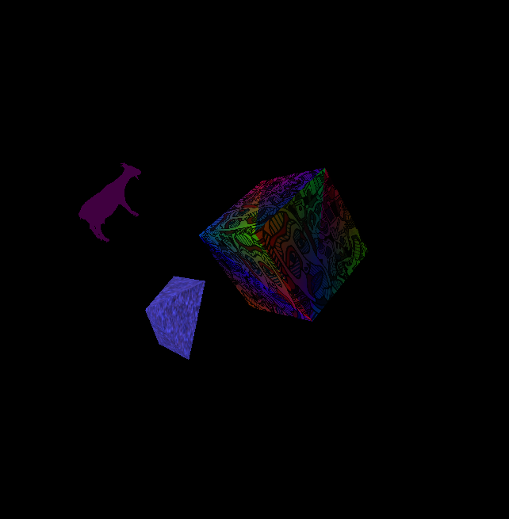

# University Project: 3D Object Animation with Shader Programming

This project showcases my university exercises in GLSL animation, written in Java and GLSL.

As part of the course, we explored the fundamentals of 3D computer graphics, focusing on how they are generated and rendered using shaders running on the GPU. Through these exercises, I gained hands-on experience in animating 3D graphics, applying textures, and implementing lighting models.

## Contents of the Exercise
The project involved using Java alongside GLSL shaders to animate 3D objects, control textures, and calculate various shading techniques, such as Lambertian and Phong shading.

We learned how to:
- Create 3D objects using coordinate systems.
- Animate their movement and transformations.
- Implement and experiment with shading models to create realistic lighting effects.

## Final Animation
For the final task, I created an animation featuring three objects:
1. **A Cube** (custom-made, textured).
2. **A Pyramid** (custom-made, textured).
3. **A Goat** (imported 3D model).

These objects follow a circular motion, with the Cube being orbited by the Pyramid, which in turn is orbited by the Goat. The Cube and Pyramid use custom-applied textures, while the Goat is an imported model.

Below is a screenshot of the animation:

This course was a great learning experience, allowing me to explore the capabilities of GLSL shaders to create animations. 
I found *[The Book of Shaders](https://thebookofshaders.com/)* particularly interesting and inspiring. 
Implementing shaders in web development is definitely something I would love to try in the future.
